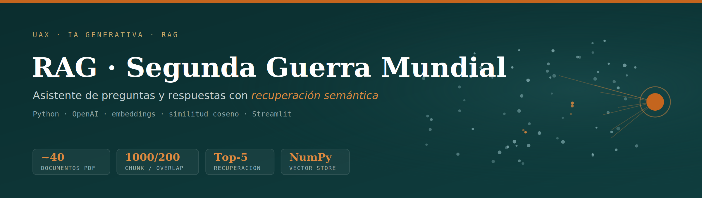

<p align="center">
  
</p>

<p align="center">
  
  
  
  
</p>

> Sistema **RAG (Retrieval-Augmented Generation)** que responde preguntas sobre la Segunda Guerra Mundial a partir de una base de conocimiento documental, combinando **búsqueda semántica** y un **modelo de lenguaje** para generar respuestas fundamentadas únicamente en las fuentes recuperadas.

---

## 🎯 Qué hace

El usuario hace una pregunta sobre la Segunda Guerra Mundial a través de una interfaz web y el sistema:

1. Convierte la pregunta en un *embedding* semántico.
2. Recupera los fragmentos más relevantes de una base de conocimiento histórica mediante similitud coseno.
3. Construye un *prompt* aumentado con esos fragmentos y genera la respuesta con un LLM, **basándose solo en el contexto recuperado** (no en el conocimiento "libre" del modelo), lo que reduce las alucinaciones y permite citar la fuente.

## 🧩 Arquitectura del RAG

El pipeline se divide en tres fases:

### 1 · Preparación del conocimiento *(offline)*
- **Fuentes:** documentos PDF sobre 5 ejes temáticos — batallas, frentes, política y sociedad, tecnología y armamento, y biografías.
- **Extracción y limpieza:** extracción de texto y metadatos, eliminación de ruido y unificación de formato.
- **Fragmentación:** división en bloques solapados (`chunk_size = 1000`, `chunk_overlap = 200`) para no perder contexto en los cortes.
- **Estructuración:** cada fragmento se guarda en JSONL con su texto y metadatos (fuente, página, tipo), junto a un set de **preguntas-respuestas manuales (QA)** que enriquecen la base.
- **Vectorización:** cada fragmento se convierte en un vector con `text-embedding-3-large` (OpenAI) y se almacena en un **vector store propio** (matriz NumPy `float32`).

### 2 · Recuperación de información *(online)*
- La pregunta del usuario se transforma en *embedding* con el mismo modelo.
- Se compara con todos los vectores almacenados mediante **similitud coseno** (implementación propia en NumPy).
- Se seleccionan los **Top-K = 5** fragmentos más relevantes, cada uno con su texto, fuente, página y *score* de similitud.

### 3 · Generación de la respuesta
- Se construye un **prompt aumentado** combinando la pregunta original con los fragmentos recuperados.
- El LLM de OpenAI genera una respuesta coherente y fundamentada en ese contexto.

  ## ✨ Detalle técnico destacable

A diferencia de un RAG "de librería", el **vector store está implementado a mano con NumPy**: el almacenamiento (matriz `float32`), el cálculo de similitud coseno y la selección de Top-K son propios, sin FAISS ni Chroma. Esto hace explícito el mecanismo interno de la recuperación semántica.

## 🛠️ Stack técnico

- **Lenguaje:** Python
- **Embeddings:** OpenAI `text-embedding-3-large`
- **Generación:** modelo de lenguaje de OpenAI
- **Vector store:** implementación propia con NumPy (similitud coseno)
- **Interfaz:** Streamlit
- **Datos:** PDFs históricos + QA manual en formato JSONL

## 📁 Estructura del repositorio

```text
03_IA_Segunda_Guerra_Mundial/
├── app.py              # Interfaz web (Streamlit) y orquestación del RAG
├── src/                # Lógica: embeddings, recuperación y generación
├── notebooks/          # Preparación de fuentes, fragmentación y pruebas
├── .gitignore
└── README.md
`

## 👤 Autora

**Lucía Cantos Burgos** — Grado en Ingeniería Matemática, Universidad Alfonso X El Sabio
[GitHub](https://github.com/luciacantos)
